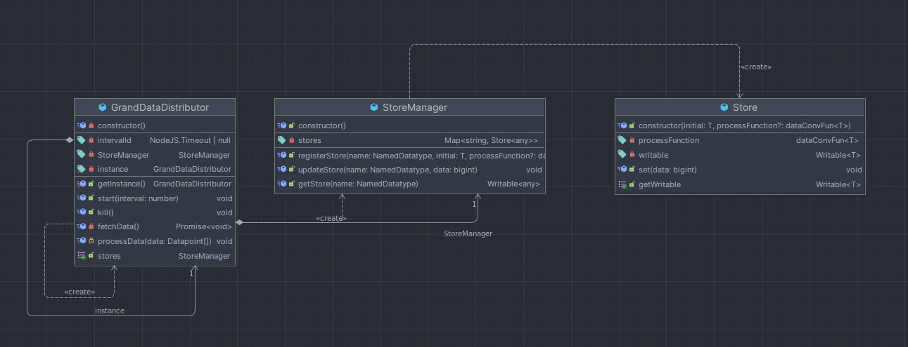

# Grand Data Distributor

This document will describe the Grand Data Distributor (GDD) system. The GDD is a system that will be used to distribute
data to the various places on the front-end that need it. The GDD will also be responsible for managing the data that is
received from the back-end and storing it in a way that is easily accessible to the front-end.

To see a concrete documentation on the API of GDD, please refer to [its  API Documentation](./api/apiGDD.md).

## Structure



The GDD is a singleton that constantly calls the `unload_buffer` command on the back-end to get the latest data given an 
interval. By default, the interval is set to 100ms. This is regulated in `/gs/src/lib/routes/+layout.svelte`.

```typescript
let gdd = GrandDataDistributor.getInstance();

// register stores here...

gdd.start(100);
```

## Registering Stores

This system is designed to work on the Datatypes defined in `/config/datatypes.toml`. The ground station UI defines a 
TypeScript type `NamedDatatype`:

```typescript
/*AUTO GENERATED USING npm run generate:datatypes */
export type NamedDatatype = "DefaultDatatype" | "PropulsionTemperature" | "LevitationTemperature" //...;
```

### Preface (auto-generating the `NamedDatatype` type)

The `NamedDatatype` type is auto-generated using the `generate:datatypes` script in the `package.json` file. To run it
use the following command:

```bash
npm run generate:datatypes
```

This script will populate the `NamedDatatype` type with all the datatypes defined in the `datatypes.toml` file.

### Registering a Store

As pointed in the UML diagram, the GDD has a method called `registerStore` that is used to register a store. It takes a
`name:NamedDatatype` which will be the name of the datatype, an `initial:T` value of the store and an optional 
`dataConvFun` function that has 2 parameters: the data received from the back-end and the current store value.

#### NamedDatatype
Here you use the auto-generated `NamedDatatype` type to ensure that the datatype you are registering is valid (since upon 
receiving a packet from the back-end, the datatype of the packet will be used to update the according store. This datatype 
is exactly a string that can be either of these auto-generated
datatypes.)

#### dataConvFun

**Every value that is sent from the back-end is in Rust type u64, equivalent to BigInt in TypeScript!**. Therefore, the
`dataConvFun` will always take a bigint as the first parameter and the current store value as the second parameter. The
function shall implement a conversion from the bigint to the desired type of the store. For example, if the store is a
table (2D array), the `dataConvFun` will convert the bigint to a 2D array like so:

```typescript
/**
 * The below function will update a cell in a 2D array with the data received from the back-end.
 * @param data The data received from the back-end
 * @param old The current 2D array
 */
(data:bigint, old:BmsModuleTemperature[]) => {
    let {id, max, min, avg} = moduleTemperature(data);

    let updatedArray = [...old]
    updatedArray[Number(id)] = {id, max, min, avg};
    return updatedArray;
}
```

## Listening to a store

After registering a store to listen to and defining its type, one can later subscribe to its value on any part of the 
front-end! This is done using the `$storeName` syntax. For example, if you have a store named `BatteryBalanceLow`:

```sveltehtml

<script lang="js">
    import {GrandDataDistributor} from "$lib";

    let storeManager = GrandDataDistributor.getInstance().stores;
    let lvBattery = $storeManager.getWritable("BatteryBalanceLow");
</script>

<p>{$lvBattery}</p>
```

### Appending to charts

If you want to append the value of a store to a chart, you will have to overwrite the function for processing the data
when registering the store. Your `dataConvFun` can also modify some state like so:

1. Choose the event channel of your chart (e.g. `current_hv`)
2. Emit the data to the event channel using the `emit` function from Tauri

```typescript
let gdd = GrandDataDistributor.getInstance();
gdd.stores.registerStore<bigint>("CurrentVelocity", BigInt(-1), data => {
    // using the Tauri api for its emit function and emit it to the chart over the event channel
    emit('speed', {data: data})
    return data;
});
```

The default behaviour of the Chart is to append the data, received on `event.payload.data` to the chart. You can of 
course modify this to support multiple series in a chart:

```typescript
gdd.stores.registerStore<bigint>("BatteryCurrentHigh", BigInt(-1), data => {
    emit('current_hv', {x: 50, y: data})
    return data;
});
```

And then when creating the chart:

```sveltehtml

<script>
    import {Chart} from "$lib";
    
    let offsetXChart:PlotBuffer;
</script>

<Chart bind:chart={offsetXChart}
       eventCallback={(event) => {
            // Append the data to the chart. We send {x: 1, y: data} to the chart
            // so, we can get them at event.payload.x and event.payload.y 
            
            // @ts-ignore
            offsetXChart.addEntry(1, z.number().parse(event.payload.x));
    
            // @ts-ignore
            offsetXChart.addEntry(2, z.number().parse(event.payload.y));
       }}
       title="Offset horizontal"
       eventChannel="current_hv" refreshRate={100}/>
```
